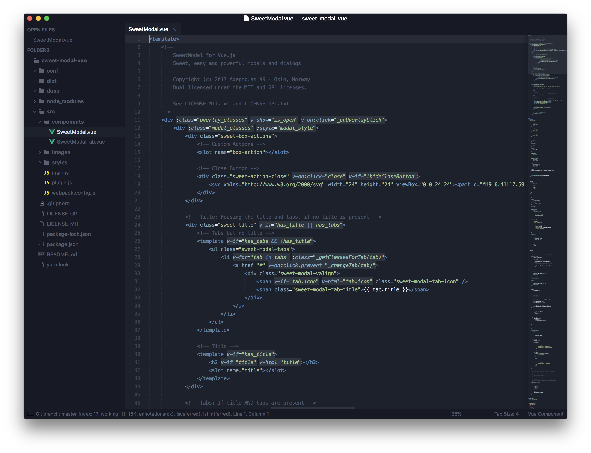

# foculor

A hyperminimal and focused theme for Sublime Text 3 (>3152). Available in two main variants and three color schemes based on Monokai.

foculor includes colored file icons as well as different font options and support for exotic languages and plugins, like Vue, VCS Gutter or SublimeLinter.

***

### Themes

#### foculor with Monokai

#### foculor with Monokai Nord

This color scheme is based on the [Nord Color Palette](https://github.com/arcticicestudio/nord).

#### foculor with Monokai Nord Atlantic

This color scheme is based on the [Nord Color Palette](https://github.com/arcticicestudio/nord).

#### foculor Light with Monokai Light

*The monospace font used in the screenshots is [__Hack__](http://sourcefoundry.org/hack/). Sidebar and Tabs are [__San Francisco Text__](https://developer.apple.com/fonts/) which can be enabled via settings.*

***

### How to Install

#### Via Package Control

The easiest way to install is using [Package Control](https://sublime.wbond.net), where foculor is listed as `Theme - foculor`.

1. Open Command Palette using menu item `Tools -> Command Palette...` (<kbd>Super</kbd><kbd>⇧</kbd><kbd>P</kbd> on Mac)
2. Choose `Package Control: Install Package`
3. Find `Theme - foculor` and hit <kbd>Enter</kbd>

#### Manual

You can also install the theme manually:

1. [Download the .zip](https://github.com/bluefirex/sublime-foculor/archive/master.zip)
2. Unzip the folder as `Theme - foculor` inside your `Packages` directory, which you can find using the menu item `Preferences -> Browse Packages...`

***

### How to Activate and Configure

Refer to [to the documentation](http://foculor.bfx.re) for configuration.

***

This theme was originally based on [Theme Spacegray](https://github.com/kkga/spacegray) by Gadzhi Kharkharov.
